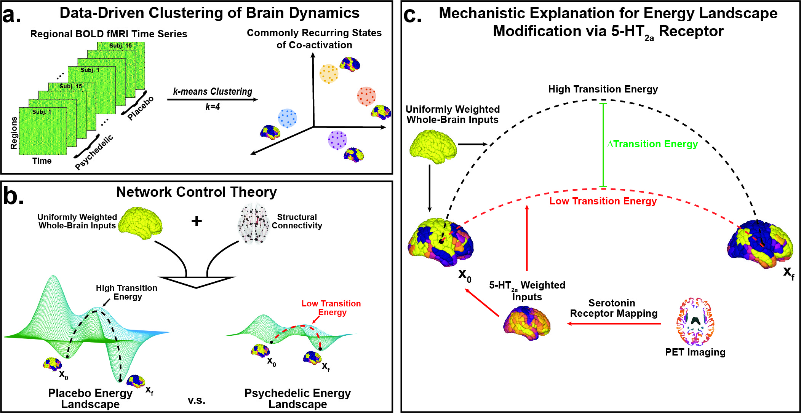

# energy_landscape

Code to reproduce analysis in Singleton et al. 2021 ("LSD flattens the brain's energy landscape: insights from receptor-informed network control theory", BioRxiv.).

This repo relies on EJC code (Cornblath et al. Comms Bio, 2020). That repo (found here: (https://github.com/ejcorn/brain_states) has been added to this repo and some functions are slightly modified. 

# Requirements:
  - MATLAB R2017a or later
  - R 3.2.5 or later, with packages:
    - ggplot2
    - R.matlab
    - RColorBrewer
    - lm.beta
    - reshape2
    - viridis
    - plotrix
  
  - Friendship and positivity
  
# Caution: 
- k-means appears to have a bug when handling singles as data-type where it will have difficulty converging compared to the same data converted to a double. Use doubles for your TxnParc time-series data.
  

## General procedure and order of operations:

Each matlab script will need you up update the `basedir` var to your own path for this repo.

`split` has options of `main`, `gsr`, `music`, `psilo`, and `sch` which represent different replications from the main analysis.

For larger projects, you may need cluster access - with 30x 15 min fMRI scans and 463 ROIs, I was able to perform all of this analysis locally on a 2020 MacBook Pro with a total run time of <1 day. The permutation test requires the most time (12 hrs), followed by replications of k-means (1hr).

You may start by specifying a range of k over which to perform your preliminary analysis. At least 3 independent analyses have now found this ideal range to be 4-6 but you may find something different. 
To check - run `repeatkmeans_sps.m` over a range of k [2:max] (see Cornblath et al 2020 for choosing max k) followed by `elbow_sps.m` to view the variance explained plot. 

After a range or particular value of k is chosen, use `ami_calc.m` to assess clustering stability and choose the partition with the highest amount of adjusted mutual information shared with all other partitions.

You can view radar plots with `systems_plot_sps.m` and gummi brains with `plotcentroidsSPS.m` made from code using KJ's atlasblobs repo (here: https://github.com/kjamison/atlasblobs)

You may find you wans to reorder your clusters for simplicity of comparing across choices of k or processing/data streams. To do this you can manually change parition values, centroid order, and cluster names with `reorder_clusters_sps.m`

Next, `transProbs.m` will generate figure 4a/b, (i) from manuscript.

`countclusters.m` will produce the violin data used in figure 3b, while `violinplots_sps.R` will produce the figures themselves (Figure 3b/c i-iii).

`subcentroids.m` will generate subject-specific centroids for energy calculations.

`T_sweep_sps.m` will sweep T and calculate energies then correlate with the emprical tansistion probabilities. Choose T that maximizes the negative correlation.

`subj_energy.m` will reproduce figure 4a/b ii-iii for a given T

`si_scripts/permute_receptor_map.m` will scramble a receptor input vector over `nperms` and recalulate weighted energies;
however, the above script has been replaced in favor of `spin_receptor_map.m` which uses a more stringent null model produced by Vasa et al Cerebral Cortex 2018
(https://doi.org/10.1093/cercor/bhx249)

`complexity_measures.m` will calculate the LZ of each subject's brain-state time-series, however this is only relevant if the partition has been ordered into a meta-state hierarchy (e.g. k=4 and 1 and 2 belong to MS-1; 3 and 4 belong to MS-2)

`E_corrs.m` will compute correlations between overall energy reduction and other values

## Raw data
The raw BOLD data used for this analysis is available at: https://openneuro.org/datasets/ds003059/versions/1.0.0

Please contact Parker Singleton (sps253@cornell.edu) with any questions regarding this code.
